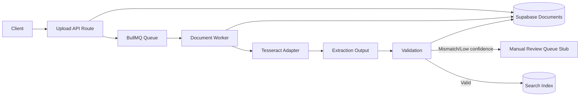

# 02 Data Flow Diagram

## Logical Flow

## Data Classification Notes

- Raw OCR output (`rawText`, `boundingBoxes`) is internal-only.
- Persisted output is sanitized structured data + deterministic hash.
- Manual review reason and transitions are audited.
